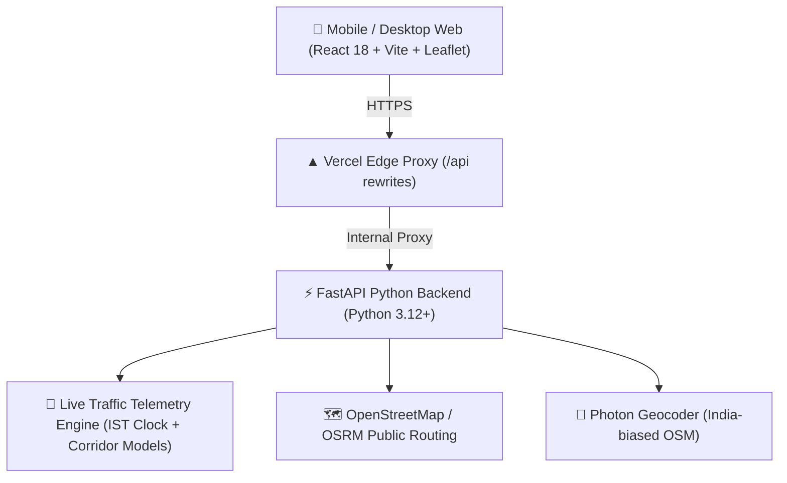

<div align="center">

# 🧭 RebelRoutes.in

### *The open-source routing lab outsmarting traffic across Indian cities.*

[](https://rebelroutes-india.vercel.app)
[](https://rebelroutes-india-api.vercel.app)
[](https://opensource.org/licenses/MIT)
[]()

<p align="center">
  <strong>Created with ❤️ by <a href="https://github.com/shubhransh-gupta">Shubhransh Gupta</a></strong>
</p>

---

</div>

> [!IMPORTANT]
> **"Google Maps will show you a dark maroon line at Silk Board and politely whisper: *'You are on the fastest route.'***  
> Standard navigation tools are built for suburban California where commuters never walk or switch modes. **RebelRoutes** turns street-smart Indian commuter cheat codes into a real-time, dynamic navigation engine."

---

## 🚦 The 5 Stages of Commuting (and The Rebel Solution)

1. **Denial:** *"Google says 35 mins. If I leave now, I'll beat the rush."*
2. **Anger:** *"Why is this lorry reversing into Silk Board at 9:15 AM?!"*
3. **Bargaining:** *"God, please let this signal turn green before my laptop battery dies."*
4. **Depression:** *The delivery guy on a bicycle just overtook you for the third time.*
5. **Rebellion:** You alight 180 meters before the bottleneck, walk across the pedestrian skywalk, re-hail a ride on the clear road ahead, and reach **20 minutes earlier**.

**RebelRoutes India** automates Stage 5.

```
[ Traditional Navigation ]
Office Desk ───────► (Stuck in Gate Queue 8m) ───────► [ Bottleneck Signal Crawl 25m ] ───────► Dest (65m)

[ RebelRoutes Multimodal Flow ]
Office Desk ──[Walk 150m to Gate]──► Free-Flow Ride ──[Walk 250m Past Jam]──► Final Ride ────► Dest (42m)
                                                      ⚡ Saves 15–25 mins!
```

---

## ⚡ Key Capabilities

### 📡 1. Live Corridor Telemetry Engine
- **13+ Dynamic Corridor Monitors** across Bengaluru (Silk Board, Bellandur EcoSpace, Tin Factory, Marathahalli, Hebbal, Goraguntepalya, Sony World, Domlur, Dairy Circle, Kadubeesanahalli, ITPL Whitefield, Jayadeva, Electronic City).
- Calculates **live crawl speeds**, **junction queue delays**, and **congestion trends** (`Severe queueing ↗`, `Clearing ↘`, `Normal flow`) in real-time.
- Live IST timestamps with on-demand refresh.

### 🗣️ 2. Commuter-Friendly Plain English (Zero Jargon)
- No confusing mathematical tensors. Commuters get actionable, step-by-step street moves:
  - **Step 1:** Walk 175m outside to the main road (~2 min walk) to skip the campus gate queue.
  - **Step 2:** At Tin Factory / KR Puram, ask the driver to drop you ~180m before the junction. Walk 380m past the signal bottleneck (~4 min walk) and re-hail on the open road.
  - **🎯 Realistic Outcome:** Arrive in ~48 mins instead of sitting in traffic for 57 mins (saving ~9 mins).
- **Honest Clear-Road Routing:** During off-peak and late-night hours, the engine honestly advises: *"Roads are clear right now. Take the direct route straight to your destination."*

### 🕒 3. Rush-Hour Simulator
Switch between scenarios with a single click:
- **🕒 Live Right Now** (evaluates against current IST time-of-day traffic).
- **🌅 9:15 AM Morning Rush** (simulates peak IT corridor inflow).
- **🌆 6:45 PM Evening Peak** (simulates arterial gridlock & campus exit jams).

### 🗺️ 4. Zero-Key Map Engine ($0 Cost)
Custom high-contrast map themes powered by open community tiles—no paid Google Maps billing accounts or watermarked APIs required:
- 🌌 **Dark Cyber** (high-contrast dark mode tailored for evening commutes).
- ☀️ **Daylight Streets** (crisp high-visibility daytime road geometry).
- 🚲 **CyclOSM Transit** (footpaths, skywalks, and transit connections).
- 🛰️ **ESRI Satellite** (high-res urban overhead imagery).

### 📱 5. Mobile-First Web Experience (mWeb)
- **Map-First Canvas:** 100% full-screen responsive map with pinch-to-zoom on smartphones.
- **Bottom Navigation Bar:** Instant thumb-switch between `🗺️ Live Map`, `🧭 Route Steps`, and `🔥 Choke Radar`.
- **Floating Commuter Drawer:** Non-intrusive floating card displaying live time saved and instant step directions.

---

## 🏙️ Supported Indian Cities & Choke Corridors

| City | Hotspots Mapped | Street-Smart Bypass Heuristic |
| :--- | :--- | :--- |
| **Bengaluru** | Silk Board, EcoSpace, Marathahalli, Tin Factory, Hebbal, Domlur, Sony World | Tech-park pedestrian back gates, metro concourse crossovers, ORR service-road rebooking |
| **Gurgaon (Gurugram)** | Shankar Chowk, IFFCO Chowk, Rajiv Chowk, Cyber City | Rapid Metro footbridge into DLF Phase 2/3, NH-48 Yellow Line subway hop |
| **Noida** | Film City flyover, Mahamaya flyover, Sector 62 / Model Town crossing | Metro skybridges, Kalindi Kunj border arterial bypass |
| **Delhi** | Ashram Chowk, Dhaula Kuan, ITO Junction | Metro station unpaid subways, Airport Express travelator concourses |
| **Pune** | Hinjawadi Phase 1/2/3 (Bhujbal & Shivaji Chowk), Chandani Chowk | Wakad bridge walk past, Bavdhan service lane pickup |
| **Mumbai** | Western Express Highway, Kalanagar / BKC Connector, Saki Naka, Powai JVLR | Suburban railway skywalks, Bandra station to BKC pedestrian bridge |
| **Hyderabad** | Cyber Towers (Hitec City), Gachibowli Flyover, Bio-Diversity Junction | Raidurg metro elevated skywalk, DLF Cyber City lane pickup |
| **Chennai** | Kathipara Cloverleaf, Madhya Kailash (OMR start), TIDEL Park | Alandur Metro interchange pedestrian subway, MRTS canal footbridge |
| **Kolkata** | Howrah Bridge approach, Park Circus 7-Point, Sector V Salt Lake | Hooghly River 5-minute ferry shortcut, Bidhannagar railway subway |
| **Lucknow** | Charbagh Station Crossing, Polytechnic Chauraha, Hazratganj | Charbagh Metro elevated concourse, Janpath heritage arcade walk |
| **Ahmedabad** | SG Highway ISKCON cross roads, Nehrunagar Circle | BRTS designated pedestrian overpasses |

---

## 🏗️ Architecture & Tech Stack



- **Frontend:** React 18, TypeScript, Vite, Tailwind CSS, Lucide Icons, Leaflet / React-Leaflet.
- **Backend:** FastAPI, Python 3.12, Pydantic v2, HTTPX, Uvicorn.
- **Routing & Geocoding:** Public OSRM + Photon OSM (100% free, 0 API keys).
- **Deployment:** Vercel (Hobby Tier — $0 forever).

---

## 💻 Local Development Setup

### Prerequisites
- Node.js 18+ & npm
- Python 3.10+

### 1. Backend Setup
```bash
cd backend
python3 -m venv venv
source venv/bin/activate  # On Windows: venv\Scripts\activate
pip install -r requirements.txt
uvicorn app.main:app --reload --port 8000
```
> Interactive API Docs will be available at: `http://localhost:8000/docs`

### 2. Frontend Setup
```bash
cd frontend
npm install
npm run dev
```
> Open `http://localhost:3000` in your browser.

---

## 🚀 One-Click Production Deployment ($0 Budget)

Both the frontend and backend are configured for frictionless deployment to Vercel at **zero cost**:

### Backend Deployment
```bash
# From repository root
npx vercel link --project rebelroutes-india-api --yes
npx vercel deploy --prod --yes
```

### Frontend Deployment
```bash
cd frontend
npm run build
npx vercel link --project rebelroutes-india --yes
npx vercel deploy --prod --yes
```

---

## 🤝 Contributing

This project is built for the Indian commuter community. We welcome contributions for:
- Adding local bottleneck coordinates and walking skywalk shortcuts in `backend/app/data/cities.json`.
- Expanding corridor telemetry profiles.
- Submitting pull requests to enhance the routing heuristics.

---

<div align="center">

**[RebelRoutes.in](https://rebelroutes-india.vercel.app)** — Crafted with ❤️ by **[Shubhransh Gupta](https://github.com/shubhransh-gupta)**  
*Distributed under the MIT License.*

</div>
